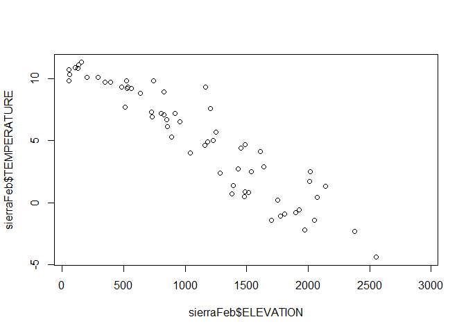

sierra
================
Jerry Davis
4/27/2021

## R Markdown

This is an R Markdown document. Markdown is a simple formatting syntax
for authoring HTML, PDF, and MS Word documents. For more details on
using R Markdown see <http://rmarkdown.rstudio.com>.

When you click the **Knit** button a document will be generated that
includes both content as well as the output of any embedded R code
chunks within the document. You can embed an R code chunk like this:

``` r
library(iGIScData); library(tidyverse)
```

    ## -- Attaching packages ---------------------------------------------------------- tidyverse 1.3.0 --

    ## v ggplot2 3.3.2     v purrr   0.3.4
    ## v tibble  3.0.3     v dplyr   1.0.2
    ## v tidyr   1.1.2     v stringr 1.4.0
    ## v readr   1.3.1     v forcats 0.5.0

    ## -- Conflicts ------------------------------------------------------------- tidyverse_conflicts() --
    ## x dplyr::filter() masks stats::filter()
    ## x dplyr::lag()    masks stats::lag()

``` r
head(sierraFeb)
```

    ## # A tibble: 6 x 7
    ##   STATION_NAME     COUNTY ELEVATION LATITUDE LONGITUDE PRECIPITATION TEMPERATURE
    ##   <chr>            <chr>      <dbl>    <dbl>     <dbl>         <dbl>       <dbl>
    ## 1 GROVELAND 2, CA~ Tuolu~      853.     37.8     -120.         176.          6.1
    ## 2 CANYON DAM, CA ~ Plumas     1390.     40.2     -121.         164.          1.4
    ## 3 KERN RIVER PH 3~ Kern        824.     35.8     -118.          67.1         8.9
    ## 4 DONNER MEMORIAL~ Nevada     1810.     39.3     -120.         167.         -0.9
    ## 5 BOWMAN DAM, CA ~ Nevada     1641.     39.5     -121.         277.          2.9
    ## 6 BRUSH CREEK RAN~ Butte      1085.     39.7     -121.         296.         NA

## Including Plots

You can also embed plots, for example:

<!-- -->

Note that the `echo = FALSE` parameter was added to the code chunk to
prevent printing of the R code that generated the plot.
