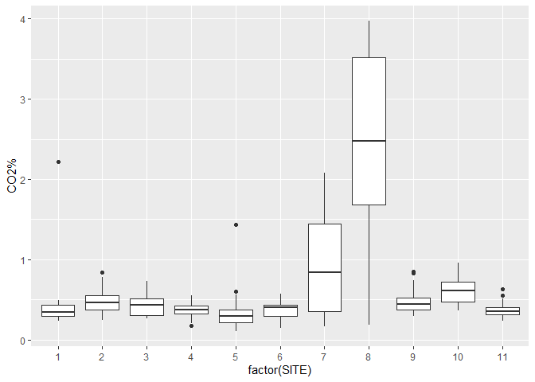

soilCO2
================
Jerry Davis
4/27/2021

## Marbles Soil CO2 graph

Simple R Markdown example…

``` r
library(iGIScData)
library(tidyverse)
summary(soilCO2_97)
```

    ##       SITE            DATE             DATE/TM              TIME         
    ##  Min.   : 1.000   Length:558         Length:558         Length:558       
    ##  1st Qu.: 3.000   Class :character   Class :character   Class1:hms       
    ##  Median : 5.000   Mode  :character   Mode  :character   Class2:difftime  
    ##  Mean   : 5.866                                         Mode  :numeric   
    ##  3rd Qu.: 8.000                                                          
    ##  Max.   :11.000                                                          
    ##                                                                          
    ##     SOIL  F          SOIL C           CO2%       
    ##  Min.   :34.70   Min.   : 1.50   Min.   :0.1100  
    ##  1st Qu.:50.00   1st Qu.:10.00   1st Qu.:0.3200  
    ##  Median :55.40   Median :13.00   Median :0.4000  
    ##  Mean   :54.34   Mean   :12.41   Mean   :0.6086  
    ##  3rd Qu.:59.72   3rd Qu.:15.40   3rd Qu.:0.5400  
    ##  Max.   :73.40   Max.   :23.00   Max.   :3.9700  
    ##  NA's   :2       NA's   :2       NA's   :50

## Including Plots

You can also embed plots, for example:

``` r
ggplot(soilCO2_97) + geom_boxplot(aes(x=factor(SITE), y=`CO2%`))
```

<!-- -->

Note that the `echo = FALSE` parameter was added to the code chunk to
prevent printing of the R code that generated the plot.
